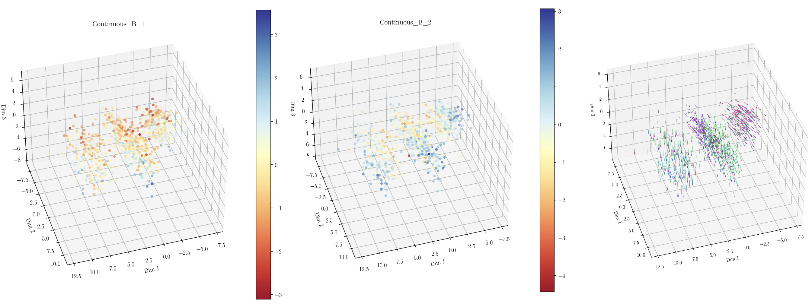

# VAEs for biomedical data integration

## Summary: 
This is the repository for the paper "On the use of VAEs for biomedical data integration". This is mostly intended to be a data repository, and it also contains a short tutorial on how to reproduce the main findings of the paper. For a detailed explanation of the Multiomics Variational Autoencoder (MOVE) we refer the reader to the MOVE repository (https://github.com/RasmussenLab/MOVE). Small code edits were added for this project, which are described in a third notebook.

**Figure 1. Latent space visualization**. *a) Latent space representation of all samples color coded by their normalized value of the feature Continuous_B1. b) Idem for Continuous_B_2. c) Movement of all samples after perturbing positively the feature Continuous_B1. Note that, since both features are positively correlated, the perturbation brings samples towards a region where feature values for both variables are higher.*

## Folder structure: 
- **configs:** Configuration files used to build the models using MOVE.
- **images:** Images for the repository.
- **scripts:** Folder containing:
  - *MOVE_edits.ipynb*. Notebook explaining what files were edited and how.
  - *AMSC_MOVE.ipynb*: Main notebook of the project. Contains the data preprocessing steps and data analysis on both synthetic data and AMSC data.
  - *Tutorial_VAEs_for_biomedical_data_integration.ipynb*: Tutorial notebook on how to install MOVE, create a synthetic dataset, analyze the latent space and identify associations.
  - *Toy_models_Elhage_et_al.ipynb*: Adaptation of the code in [the colab notebook](https://colab.research.google.com/github/anthropics/toy-models-of-superposition/blob/main/toy_models.ipynb) from Anthropic's paper by Elhage et al. [Toy models of superposition](https://transformer-circuits.pub/2022/toy_model/index.html). The notebook shows the behaviour of a simple autoencoder when compressing inputs under different correlation regimes.
    
## Other files:
Heavier files (e.g. model weights for the 24 refits of the model architecture used to identify associations) were not uploaded here due to their size. Note that different runs will yield different sets of weights, and hence different looking latent spaces. The paper was written so that the underlying principles presented are reproducible regardless of the dataset or machine used.

