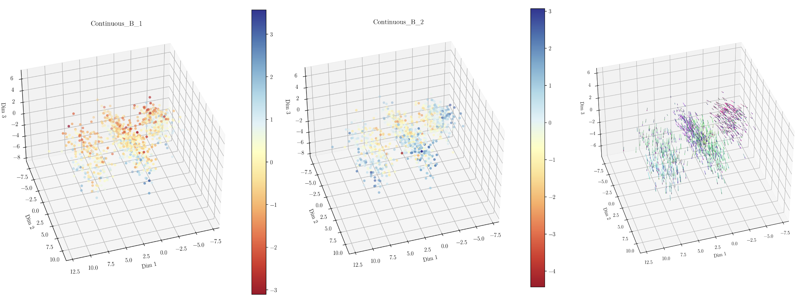

# On the use of VAEs for biomedical data integration

## Summary: 
This is the repository for the paper _On the use of VAEs for biomedical data integration_. It contains the code and main configs used in the paper, but also includes a short tutorial on how to reproduce our main findings regarding the emerging latent space dynamics. For a detailed explanation of the Multiomics Variational Autoencoder (MOVE) python package we refer the reader to the [MOVE repository](https://github.com/RasmussenLab/MOVE). Small code edits were added for this project, which are described in a separate notebook.



**Figure 1. Latent space visualization**. *a) Latent space representation of all samples color coded by their normalized value of the feature Continuous_B1. b) Idem for Continuous_B_2. c) Movement of all samples after perturbing positively the feature Continuous_B1. Note that, since both features are positively correlated, the perturbation brings samples towards a region where feature values for both variables are higher.*

## Repository structure: 
- **images:** Images for the repository.
- **scripts:** Folder containing:
  - *On_the_use_of_VAEs_for_biomedical_data_integration.ipynb*: Main notebook of the project describing the obtention, preprocessing and analyses of the following datasets:
     1) **Synthetic dataset:** Data generated on the fly, used to illustrate the emerging latent dynamics on a dataset with well defined ground truths.
     2) **Inflammatory Bowel Disease (IBD) multiomics dataset:** We applied MOVE to the data from the [IBDMDB](https://ibdmdb.org/). The dataset is used to show the multiomics data integration axis of MOVE in a real-world biomedical setting.
     3) **Perturb-seq datasets on K562 and RPE1:** We used [Replogle's datasets](https://doi.org/10.1016/j.cell.2022.05.013) as provided by [GEARS](https://www.nature.com/articles/s41587-023-01905-6) to benchmark the performance of the *in silico* perturbational approaches of MOVE with that of the other models presented in [Ahlmann-Eltze et al.](https://doi.org/10.1038/s41592-025-02772-6).

  - *MOVE_edits.ipynb*. Notebook explaining what files in the MOVE source code were modified for this project and how.
  - *Tutorial_VAEs_for_biomedical_data_integration.ipynb*: notebook on how to install MOVE, create a synthetic dataset, analyze the latent space, identify associations and visualize the perturbation effects on sample embeddings. The following hyperlink opens it as a Google Colab notebook:

      [](https://colab.research.google.com/github/RasmussenLab/VAEs_for_biomedical_data_integration/blob/main/scripts/Tutorial_VAEs_for_biomedical_data_integration.ipynb)  
  - *Toy_models_Elhage_et_al.ipynb*: Adaptation of the code in [the colab notebook](https://colab.research.google.com/github/anthropics/toy-models-of-superposition/blob/main/toy_models.ipynb) from Anthropic's paper by Elhage et al. [Toy models of superposition](https://transformer-circuits.pub/2022/toy_model/index.html). The notebook shows the behaviour of a simple autoencoder when compressing inputs under different correlation regimes.

    - **configs:** The MOVE framework uses [hydra](https://hydra.cc/docs/intro/) to manage and define most hyperparameters related to model architecture and training. These hyperparameters are specified in a number of configuration files. This folder contains the baseline configuration files we used to build the models. Please note that it is found inside the ```script``` folder so that, when cloning the repository, the folder structure is MOVE-friendly and allows the user to run *On_the_use_of_VAEs_for_biomedical_data_integration.ipynb* directly.
    
## Other files:
Heavier files (e.g. model weights for the 24 refits of the model architecture used to identify associations) were not uploaded here due to their size. Note that different runs will yield different sets of weights, and hence different looking latent spaces. The paper was written so that the underlying principles presented are reproducible regardless of the dataset or machine used.


